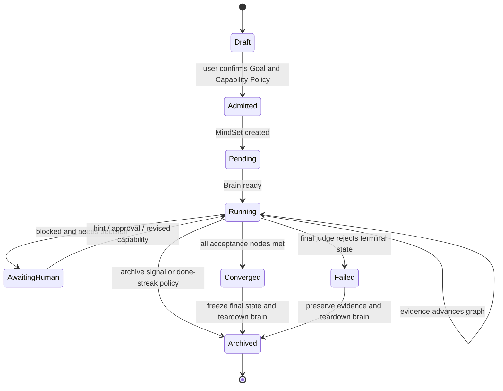
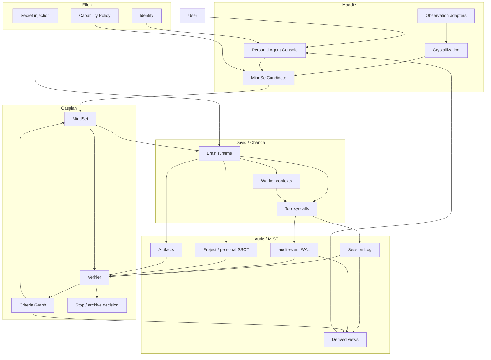

# MindOS: AI-native OS based on cloud-native

## Summary

MindOS is an operating-system architecture for AI operations. It builds on
cloud-native APIs, workloads, controllers, runtimes, secrets, events, and
observability, and turns AI operation into a schedulable, verifiable,
auditable, and rollback-capable system process.

In MindOS, the user does not submit an instruction stream. The user submits a
Goal that describes the desired end state. The system turns the Goal into a
MindSet process, schedules execution through CocoonSet, maintains structured
convergence state through a Verifier, and records critical observations and
side effects through session logs and audit events. Based on evidence, the
system decides whether to keep running, request human intervention, archive,
rollback, or commit completion.

The core problem is:

> How to turn a natural-language goal into an operating-system process with a
> lifecycle, permission boundary, execution context, state machine, audit log,
> and rollback semantics.

## Design Constraints

MindOS is driven by six constraints:

1. **Goal is the program entrypoint.** A Goal describes the desired end state
   and acceptance criteria. It is not a persistent chat context.
2. **MindSet is the process instance.** A MindSet owns the Goal summary,
   lifecycle, convergence graph, execution references, and final state.
3. **Verifier is the state-convergence function.** The Verifier migrates graph
   state from evidence. It does not decide completion from an agent's claims.
4. **Executor and arbiter are separated.** Brain and Worker contexts produce
   observations and side effects. The Convergence Kernel judges state.
5. **Logs and audit are WAL.** Session logs and audit events are the basis for
   reconstructing facts, explaining verdicts, and executing rollback.
6. **Derived memory cannot replace fact sources.** Summaries, feeds, cards,
   embeddings, and caches can speed up the system, but cannot be final
   adjudication sources.

## OS Abstraction Mapping

| OS abstraction | cloud-native counterpart | MindOS counterpart |
|---|---|---|
| Program | Image / Manifest | Goal / GoalRef |
| Process | Workload instance | MindSet |
| Execution context | Pod / Replica | Brain Agent / Worker Agent / paired agent |
| System call | Runtime call | Tool / Skill / MCP / CLI action |
| Scheduling | Scheduler / Controller | CocoonSet + Worker Fabric |
| Exit status | Pod phase / Job condition | Verifier verdict + convergence graph |
| Filesystem | Volume / object store | SSOT + epoch artifact + gitea |
| Log | stdout / event | Session Log + audit-event |
| Signal | kill / suspend / scale | hint / pause / archive / rollback |
| Permission | RBAC / Secret | Capability policy / secretMount / envFromSecrets |

## Resource Model

### Goal

A Goal is the executable specification of user intent. A valid Goal contains
at least:

- desired end state;
- verifiable acceptance criteria;
- pitfalls that must not occur;
- system boundaries to read or operate;
- acceptable human-intervention points;
- required capability set.

After submission, the Goal is fixed by a digest. Changing the Goal of a running
process changes the program entrypoint; it should create a new MindSet or record
an explicit goal-change checkpoint.

### MindSet

A MindSet is a process instance of a Goal. It owns:

- `spec.goal` / `spec.goalRef`: program entrypoint;
- `spec.project`: project and SSOT boundary;
- `spec.mode`: batch or continuous;
- `spec.agent`: execution runtime hint;
- `spec.scene` / `spec.pair`: desktop or cross-OS execution scenario;
- `status.phase`: lifecycle such as Pending, Running, Converged, Failed, and
  Archived;
- `status.goalDigest`: fixed Goal fingerprint;
- `status.progress`: current verdict summary;
- `status.convergenceGraph`: structured convergence state;
- `status.verifierJournal`: append-only Verifier history.

### Criteria Graph

The Criteria Graph decomposes a Goal into a stable graph of criteria. Each node
describes one verifiable proposition:

```json
{
  "id": "c1",
  "text": "The release script passes lint on both darwin and linux",
  "kind": "acceptance",
  "status": "pending",
  "weight": 5,
  "category": "Essential",
  "verify": "GOOS=darwin make lint && GOOS=linux make lint",
  "evidence": [],
  "deps": []
}
```

Node kinds:

| kind | Meaning | Gates Done |
|---|---|---|
| `acceptance` | A final-state condition that must hold | Yes |
| `enabling` | An intermediate condition that supports acceptance | No |
| `pitfall` | A negative condition that must not occur | No, but firing deducts progress and is Diverged evidence |

Node statuses:

| status | Meaning |
|---|---|
| `pending` | No evidence yet |
| `in_progress` | Work is visible, but the criterion is not satisfied |
| `met` | Evidence proves the criterion is satisfied |
| `regressed` | Evidence proves that a previously met criterion no longer holds |

The `met` status is sticky. A node can move from `met` to `regressed` only with
a reason and evidenceRefs. Silent downgrades are not allowed.

### Capability Policy

Capability Policy describes the system capabilities a MindSet may read or
operate. It should not be written into the Goal body or baked into image layers.
Typical capabilities include:

- K8s namespace / kubeconfig;
- git remote / branch;
- cloud API credentials;
- desktop / browser / mobile automation permission;
- Secret mount;
- tool allowlist;
- mutating syscall approval rule.

### Observation

An Observation is a fact fragment observed by the system or by a private agent.
An Observation must carry:

- source;
- timestamp;
- retention;
- owner;
- permission boundary;
- whether-shareable;
- derived-from refs.

By default, an Observation belongs to the user's private domain. It can become
evidence readable by the Verifier only after it is explicitly promoted into the
Goal, audit, or evidence path.

### Opportunity

An Opportunity is a handoff candidate distilled from Observations. It is a
candidate task, not a running process:

```json
{
  "sourceRefs": ["obs-2026-06-05-001"],
  "pattern": "The same release check appeared three times in one week",
  "suggestedGoal": "Turn the release check into a reusable MindSet template",
  "risk": "needs deploy credentials",
  "requiredCapabilities": ["repo:internal/deploy", "kube:mindset-system"],
  "userDecision": "pending"
}
```

## Component Model

| Component | System role | Engineering mapping | Boundary |
|---|---|---|---|
| **Maddie** | Personal Agent Shell | `mindset-web`, conversation API, Goal refine, Project selector, observation adapters | Observes user-authorized work signals, crystallizes private knowledge, and proposes MindSet candidates and handoff requests. |
| **Caspian** | Convergence Kernel | `mindset-controller`, `verifier/`, `MindSet.status` | Maintains the Criteria Graph, writes verdict / progress / stop condition, and decides process terminal state. |
| **David** | Brain Runtime | autonomous CocoonSet, `mind-agent` VM, codex loop | Executes the Goal, calls tools, and produces session logs, artifacts, commits, and audit events. |
| **Chanda** | Worker Fabric | CocoonSet replicas, sub-agent slots, paired Linux / Windows agents | Carries parallel or heterogeneous execution contexts; produces evidence and side effects, but does not decide terminal state. |
| **Laurie** | Audit and Recovery Plane | `mind-ob`, session log, audit-event, rollback API, archive finalBrainOutput | Stores WAL, indexes side effects, generates rollback scripts, and preserves archived evidence. |
| **MIST** | Memory and SSOT Fabric | Project SSOT, gitea, epoch artifacts, VerifierJournal, personal-SSOT | Manages the hierarchy between fact sources and derived memory. |
| **Ellen** | Trust Plane | ByteSSO OIDC, K8s Secret, secretMounts, envFromSecrets, capability policy | Manages identity, credentials, authorization boundaries, and capability injection. |

## Maddie: Personal Agent Shell

Maddie is the user's private agent shell. Her role is not to wait for prompts,
but to observe workflows within user-authorized boundaries, crystallize
structured knowledge, propose handoffable tasks, and submit MindSets only after
user confirmation.

### Three-stage Loop

| Stage | Input | Output |
|---|---|---|
| Listen | Desktop, IM, repo activity, calendar, MindSet status, audit-event, Project SSOT | Observation |
| Crystallize | Observation, historical user decisions, project constraints, cost and stall patterns | PersonalSSOT, Opportunity, risk note |
| Solve | Opportunity, user confirmation, Capability Policy | MindSetCandidate, handoff request, approval request |

### UI Structure

Maddie's UI should be a Personal Agent Console, not a single chat box:

- **Discovery Feed**: active discoveries such as automation opportunities,
  repeated work, stall patterns, and cost anomalies;
- **Knowledge Crystals**: crystallized user preferences, project habits, and
  team rules, with source inspection and revocation;
- **Handoff Inbox**: permissions, risks, rollback choices, and handoff items
  requiring user decisions;
- **MindSet Draft Studio**: Goal, criteria, pitfall, and Capability Policy
  editing;
- **Portfolio Radar**: every MindSet owned by the user, including running
  state, blocked state, cost, and archive suggestions.

### Permission Boundary

Maddie's Observations are local-first and private by default. Sharing them with
a Project, turning them into evidence, granting David execution permission, or
triggering a mutating syscall requires policy authorization or user
confirmation.

Maddie determines what the user may need. Caspian determines whether the system
has satisfied the Goal. These responsibilities must remain separate.

## Lifecycle



### Draft

Maddie generates a MindSetCandidate. The candidate is not a process and does not
own execution permissions.

### Admitted

The user confirms the Goal, Capability Policy, Project, mode, and risk
statement. The system creates a MindSet.

### Pending

Caspian creates or confirms the execution CocoonSet. Ellen injects allowed
Secrets and capabilities. David has not yet produced effective evidence.

### Running

David / Chanda execute the task. Laurie records session logs and audit events.
Caspian periodically reads evidence and migrates the Criteria Graph.

### AwaitingHuman

The system needs a user decision, authorization, hint, or rollback selection.
This state does not change the Goal itself.

### Converged

All acceptance nodes are `met`, and no blocking pitfall has fired. Converged is
an evidence state, not an agent self-report.

### Failed

The final judge cannot prove that the Goal was achieved, or the execution
context entered an unrecoverable error.

### Archived

The system freezes final state, verifier journal, final brain output, and key
evidence. It then stops the Brain and keeps the record visible to the user.

## Data Flow



## Verifier Semantics

Verifier inputs:

- Goal;
- session log;
- audit-event;
- Project SSOT;
- artifact refs;
- current Criteria Graph;
- VerifierJournal.

Verifier outputs:

- verdict;
- currentStep;
- blockedReason;
- note;
- graph transitions;
- summary;
- findings;
- next human decision request.

### Done Condition

`Done` holds only when all conditions below are true:

1. at least one acceptance node exists;
2. every acceptance node is `met`;
3. every `met` acceptance node has evidence;
4. no blocking pitfall has fired;
5. the final judge can reconstruct the same conclusion from WAL / SSOT /
   artifact.

### Progress Function

Progress is derived from graph state, not from free-form Verifier scoring:

```text
phi = (sum(weight of met positive nodes) - sum(weight of fired pitfall nodes))
      / sum(weight of all positive nodes)
progress = clamp(round(phi * 100), 0, 100)
```

`in_progress` does not count toward progress. Activity cannot increase
completion; only evidence-backed state migration can.

## Execution and Parallelism

David owns the main execution loop. Chanda carries parallel workers or
heterogeneous execution contexts. Creating parallel workers must satisfy
criterion independence:

```text
fork is valid only if I(c_i ; c_j) ~= 0
```

Here, `c_i` and `c_j` are independently verifiable criteria in the Criteria
Graph. Sequentially dependent tasks should remain in the same Brain. Splitting
workers only because the context is long, token usage is high, or the workflow
has many steps increases coordination entropy.

## System Calls and Audit

In MindOS, mutating actions should enter the system through auditable syscalls:

| syscall class | Examples | Audit requirements |
|---|---|---|
| git | commit, push, revert | commit sha, parent, diff stat, revert script |
| K8s | apply, patch, delete, rollout | beforeRef, afterRef, namespace, resource |
| Desktop | click, type, scroll, file operation | screen ref, action trace, rollback hint |
| Browser | navigate, form submit, download | URL, DOM / screenshot ref, side-effect class |
| Cloud API | create / update / delete resource | request digest, resource id, rollback command |
| Filesystem | write / delete / chmod | path, before digest, after digest |

audit-event must be append-only. Rollback executes new forward actions; it does
not mutate history.

## Memory Model

| Layer | Authority | Examples | Rule |
|---|---|---|---|
| WAL | authoritative | session log, audit-event, VerifierJournal | Append only |
| Committed State | authoritative | gitea main, Project SSOT, epoch artifact, MindSet status | Can be cited as fact source |
| Private State | owner-scoped | PersonalSSOT, Observation, Opportunity | Private by default |
| Materialized View | derived | summary, feed, cards, embedding, token badge | Cacheable and invalidatable; cannot adjudicate |

Derived views must retain sourceRefs. If a verdict cannot be explained from a
derived view, it must be reconstructed from WAL and Committed State.

## Permissions and Privacy

MindOS permission boundaries are managed by Ellen:

- user identity is bound through SSO or an equivalent identity system;
- Observations are private by default;
- Capability Policy determines which secrets, tools, clusters, repos, and
  runtimes a MindSet may access;
- Secrets are injected through secretMount or envFromSecrets, not written into
  Goals, logs, images, or git;
- mutating syscalls can require user confirmation according to risk level;
- share, publish, handoff, and evidence promotion are explicit actions.

Maddie can actively discover, but cannot actively expand permissions. David can
execute, but only within granted capabilities. Caspian can judge, but only from
readable evidence.

## Archive and Rollback

Archive stops execution contexts while preserving records:

1. capture final progress, summary, verifier journal, brain output, and key
   evidence;
2. write them into MindSet status;
3. stop or delete Brain / Worker CocoonSets;
4. preserve UI-visible records;
5. prevent archived processes from consuming model and runtime resources.

Rollback reverts rollback-capable side effects after a selected iter:

1. query paired revert-scripts from audit-event;
2. execute new revert actions in reverse chronological order;
3. write a new audit-event for each rollback action;
4. keep git / audit / status history forward-only;
5. record partialIter and failure reason on failure.

## API Example

```yaml
apiVersion: mindset.cocoonstack.io/v1
kind: MindSet
metadata:
  name: release-check-template
spec:
  project: cocoon
  mode: batch
  goal: |
    Build a reusable release-check template for cocoon services.
    Acceptance:
    - The template defines darwin and linux lint gates.
    - The template records deploy evidence requirements.
    - The template rejects credentials in goal, git, image, and logs.
    Pitfalls:
    - Do not modify existing release scripts unless explicitly required.
    - Do not write any secret value into repository files.
  agent:
    runtime: linux
    executor: codex
```

## System Invariants

1. Goal digest fixes the process entrypoint.
2. Verifier verdict has a single write path.
3. `Done` must be derived from the Criteria Graph.
4. A `met` rollback must carry reason and evidenceRefs.
5. Session log and audit-event are append-only.
6. Summaries, feeds, cards, and embeddings cannot be final adjudication
   sources.
7. Secrets do not enter Goal, image, git, or logs.
8. Worker fork requires criterion independence.
9. Mutating syscall must produce audit-event.
10. Archive preserves records and stops resource consumption.
