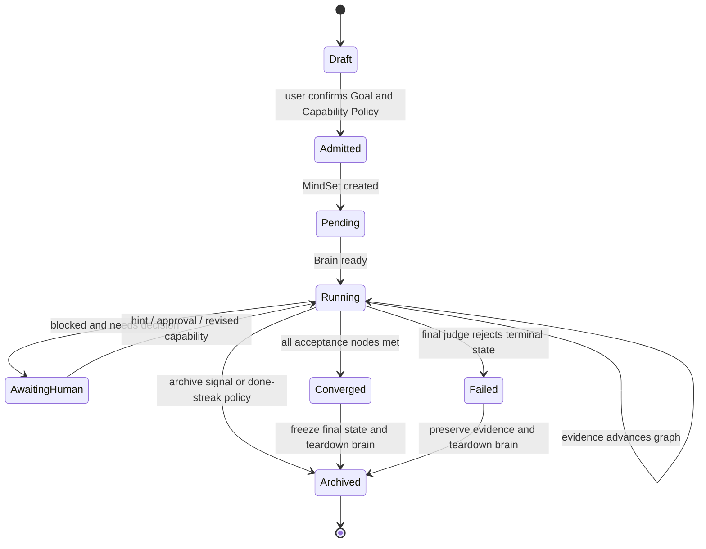
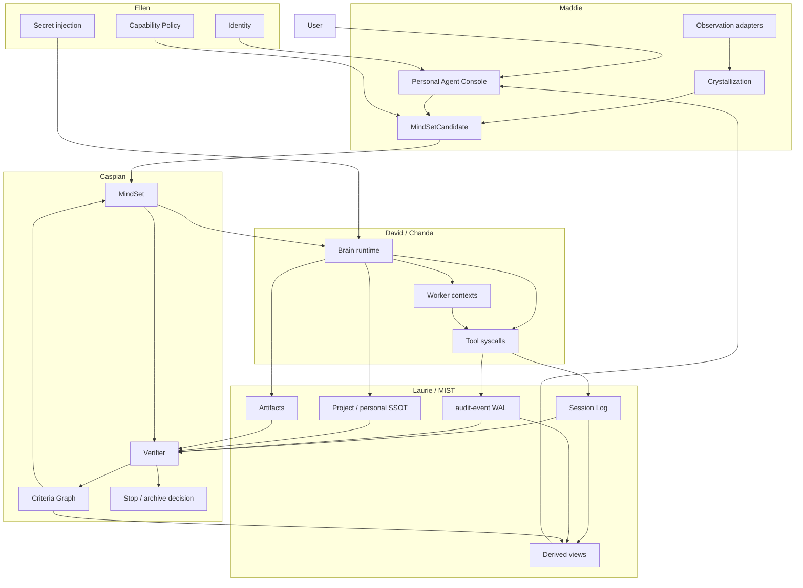

# MindOS: AI-native OS based on cloud-native

## 摘要

MindOS 是一套面向 AI 操作的操作系统架构。它以 cloud-native 的
API、Workload、Controller、Runtime、Secret、Event 和 Observability 为
基础，将 AI 操作抽象为可调度、可验证、可审计、可回滚的系统进程。

在 MindOS 中，用户提交的不是指令流，而是描述终态的 Goal。系统将 Goal
转化为 MindSet 进程，通过 CocoonSet 调度执行环境，通过 Verifier 维护结构化
收敛状态，通过 session log 与 audit-event 记录所有关键观察和副作用。最终，
系统根据证据决定继续执行、请求用户介入、归档、回滚或提交完成。

核心问题可以表述为：

> 如何把自然语言目标转化为一个具备生命周期、权限边界、执行上下文、状态机、
> 审计日志和回滚语义的操作系统进程。

## 设计约束

MindOS 的设计由六条约束驱动：

1. **Goal 是程序入口。** Goal 描述期望终态和验收标准，不表示持续聊天上下文。
2. **MindSet 是进程实例。** MindSet 持有 Goal 摘要、生命周期、收敛图、执行引用和最终状态。
3. **Verifier 是状态收敛函数。** Verifier 对证据和判据图做状态迁移，不根据 agent 自述判定完成。
4. **执行者与裁决者分离。** Brain / Worker 负责产生观察和副作用，Convergence Kernel 负责判定状态。
5. **日志和审计是 WAL。** session log 与 audit-event 是重建事实、解释判定和执行回滚的依据。
6. **派生记忆不能替代事实源。** summary、feed、cards、embedding、cache 只能提速，不能作为最终裁决来源。

## OS 抽象映射

| OS 抽象 | cloud-native 对应 | MindOS 对应 |
|---|---|---|
| 程序 | Image / Manifest | Goal / GoalRef |
| 进程 | Workload instance | MindSet |
| 执行上下文 | Pod / Replica | Brain Agent / Worker Agent / paired agent |
| 系统调用 | Runtime call | Tool / Skill / MCP / CLI action |
| 调度 | Scheduler / Controller | CocoonSet + Worker Fabric |
| 退出状态 | Pod phase / Job condition | Verifier verdict + convergence graph |
| 文件系统 | Volume / object store | SSOT + epoch artifact + gitea |
| 日志 | stdout / event | Session Log + audit-event |
| 信号 | kill / suspend / scale | hint / pause / archive / rollback |
| 权限 | RBAC / Secret | Capability policy / secretMount / envFromSecrets |

## 资源模型

### Goal

Goal 是用户意图的可执行规格。一个有效 Goal 至少包含：

- 目标终态；
- 可验证的 acceptance criteria；
- 不允许发生的 pitfall；
- 需要读取或操作的系统边界；
- 可接受的人工介入点；
- 需要的能力集合。

Goal 在提交后通过 digest 固定。对已运行进程修改 Goal 会改变程序入口，应创建新的
MindSet 或显式记录 goal-change checkpoint。

### MindSet

MindSet 是 Goal 的进程实例。它持有：

- `spec.goal` / `spec.goalRef`：程序入口；
- `spec.project`：所属项目与 SSOT 边界；
- `spec.mode`：batch 或 continuous；
- `spec.agent`：执行 runtime hint；
- `spec.scene` / `spec.pair`：桌面或跨 OS 执行场景；
- `status.phase`：Pending、Running、Converged、Failed、Archived 等生命周期；
- `status.goalDigest`：Goal 固定指纹；
- `status.progress`：当前裁决摘要；
- `status.convergenceGraph`：结构化收敛状态；
- `status.verifierJournal`：Verifier 的 append-only 历史。

### Criteria Graph

Criteria Graph 将 Goal 拆解为稳定的判据图。每个节点描述一个可验证命题：

```json
{
  "id": "c1",
  "text": "发布脚本在 darwin 与 linux 上均通过 lint",
  "kind": "acceptance",
  "status": "pending",
  "weight": 5,
  "category": "Essential",
  "verify": "GOOS=darwin make lint && GOOS=linux make lint",
  "evidence": [],
  "deps": []
}
```

节点类型：

| kind | 含义 | 是否决定 Done |
|---|---|---|
| `acceptance` | 终态必须满足的验收条件 | 是 |
| `enabling` | 支撑验收条件的中间条件 | 否 |
| `pitfall` | 不允许发生的负向条件 | 否，但触发会扣减进度并构成 Diverged 证据 |

节点状态：

| status | 含义 |
|---|---|
| `pending` | 尚无证据 |
| `in_progress` | 有执行迹象，但未满足判据 |
| `met` | 已有证据证明满足 |
| `regressed` | 原先满足的节点被证据证明失效 |

`met` 状态具备黏性。节点从 `met` 回退到 `regressed` 必须携带 reason 和
evidenceRefs，禁止静默降级。

### Capability Policy

Capability Policy 描述一个 MindSet 可读取或操作的系统能力。它不应写入 Goal
正文，也不应烘进镜像层。典型能力包括：

- K8s namespace / kubeconfig；
- git remote / branch；
- cloud API credentials；
- desktop / browser / mobile automation 权限；
- Secret mount；
- tool allowlist；
- mutating syscall approval rule。

### Observation

Observation 是系统或私人 agent 观察到的事实片段。Observation 必须包含：

- source；
- timestamp；
- retention；
- owner；
- permission boundary；
- whether-shareable；
- derived-from refs。

Observation 默认属于用户私人域。它只有在被显式纳入 Goal、audit 或 evidence
路径后，才可能成为 Verifier 可读取的证据。

### Opportunity

Opportunity 是从 Observation 中提炼出的可交接事项。它是候选任务，不是已运行进程：

```json
{
  "sourceRefs": ["obs-2026-06-05-001"],
  "pattern": "同一发布检查在一周内重复出现三次",
  "suggestedGoal": "将发布检查转成可复用 MindSet 模板",
  "risk": "needs deploy credentials",
  "requiredCapabilities": ["repo:internal/deploy", "kube:mindset-system"],
  "userDecision": "pending"
}
```

## 组件模型

| 组件 | 系统角色 | 工程映射 | 边界 |
|---|---|---|---|
| **Maddie** | Personal Agent Shell | `mindset-web`、conversation API、Goal refine、Project selector、observation adapters | 观察用户授权的工作信号，结晶 private knowledge，提出 MindSet 候选和 handoff 请求。 |
| **Caspian** | Convergence Kernel | `mindset-controller`、`verifier/`、`MindSet.status` | 维护 Criteria Graph，写入 verdict / progress / stop condition，决定进程终态。 |
| **David** | Brain Runtime | autonomous CocoonSet、`mind-agent` VM、codex loop | 执行 Goal，调用工具，产生 session log、artifact、commit 和 audit-event。 |
| **Chanda** | Worker Fabric | CocoonSet replicas、sub-agent slots、paired Linux / Windows agents | 承载并行或异构执行上下文；只负责产生证据和副作用，不负责终态裁决。 |
| **Laurie** | Audit and Recovery Plane | `mind-ob`、session log、audit-event、rollback API、archive finalBrainOutput | 保存 WAL、索引副作用、生成回滚脚本、保留归档态证据。 |
| **MIST** | Memory and SSOT Fabric | Project SSOT、gitea、epoch artifacts、VerifierJournal、personal-SSOT | 管理事实源和派生记忆的层级关系。 |
| **Ellen** | Trust Plane | ByteSSO OIDC、K8s Secret、secretMounts、envFromSecrets、capability policy | 管理身份、凭证、授权边界和能力注入。 |

## Maddie: Personal Agent Shell

Maddie 是用户侧的私人 agent shell。她的职责不是等待 prompt，而是在用户授权的
范围内观察工作流、提炼结构化知识、提出可交接任务，并在用户确认后提交
MindSet。

### 三段式循环

| 阶段 | 输入 | 输出 |
|---|---|---|
| Listen | 桌面、IM、repo activity、calendar、MindSet 状态、audit-event、Project SSOT | Observation |
| Crystallize | Observation、历史用户决策、项目约束、成本和阻塞模式 | PersonalSSOT、Opportunity、risk note |
| Solve | Opportunity、用户确认、Capability Policy | MindSetCandidate、handoff request、approval request |

### UI 结构

Maddie 的 UI 应是 Personal Agent Console，而不是单个聊天框：

- **Discovery Feed**：展示主动发现的机会、重复工作、阻塞模式和成本异常；
- **Knowledge Crystals**：展示已结晶的用户偏好、项目习惯和团队规则，并支持撤销；
- **Handoff Inbox**：展示需要用户决策的权限、风险、回滚和交接项；
- **MindSet Draft Studio**：编辑 Goal、criteria、pitfall、Capability Policy；
- **Portfolio Radar**：展示用户所有 MindSet 的运行态、阻塞态、成本和归档建议。

### 权限边界

Maddie 的 Observation 默认 local-first，默认属于用户私人域。共享给 Project、
转化为 evidence、授予 David 执行权限或触发 mutating syscall，都需要策略授权
或用户确认。

Maddie 判断用户可能需要什么；Caspian 判断系统是否已经满足 Goal。二者不能合并。

## 生命周期



### Draft

Maddie 生成 MindSetCandidate。Candidate 还不是进程，不拥有执行权限。

### Admitted

用户确认 Goal、Capability Policy、Project、mode 和风险说明。系统生成 MindSet。

### Pending

Caspian 创建或确认执行 CocoonSet。Ellen 注入允许的 Secret 和能力。David 仍未开始
产生有效证据。

### Running

David / Chanda 执行任务，Laurie 记录 session log 与 audit-event，Caspian 周期性
读取证据并迁移 Criteria Graph。

### AwaitingHuman

系统需要用户提供判断、授权、提示或回滚选择。该状态不改变 Goal 本身。

### Converged

所有 acceptance 节点均为 `met`，且没有触发阻断性的 pitfall。Converged 是证据
状态，不是 agent 自报。

### Failed

最终裁决无法证明 Goal 达成，或执行上下文进入不可恢复错误。

### Archived

系统冻结 final state、verifier journal、final brain output 与关键 evidence，随后
停止 Brain，保留用户可查看的记录。

## 数据流



## Verifier 语义

Verifier 输入：

- Goal；
- session log；
- audit-event；
- Project SSOT；
- artifact refs；
- 当前 Criteria Graph；
- VerifierJournal。

Verifier 输出：

- verdict；
- currentStep；
- blockedReason；
- note；
- graph transitions；
- summary；
- findings；
- next human decision request。

### Done 条件

`Done` 只在以下条件同时满足时成立：

1. 至少存在一个 acceptance node；
2. 所有 acceptance node 均为 `met`；
3. 每个 `met` acceptance node 都有 evidence；
4. 没有触发阻断性的 pitfall；
5. final judge 能从 WAL / SSOT / artifact 重建同一结论。

### 进度函数

进度由图状态推导，不由 Verifier 自由打分：

```text
phi = (sum(weight of met positive nodes) - sum(weight of fired pitfall nodes))
      / sum(weight of all positive nodes)
progress = clamp(round(phi * 100), 0, 100)
```

`in_progress` 不计入进度。活动迹象不能提升完成度，只有证据迁移能提升完成度。

## 执行与并行

David 负责主执行循环。Chanda 承载并行 worker 或异构执行上下文。并行创建必须
满足子任务独立性：

```text
fork is valid only if I(c_i ; c_j) ~= 0
```

其中 `c_i`、`c_j` 是 Criteria Graph 中可独立验证的判据。顺序依赖任务应保留在
同一 Brain 中执行；仅因为上下文较长、token 较多或步骤较多而拆分 worker，会增加
协调熵。

## 系统调用与审计

MindOS 中的 mutating action 应通过可审计 syscall 进入系统：

| syscall 类别 | 例子 | 审计要求 |
|---|---|---|
| git | commit、push、revert | commit sha、parent、diff stat、revert script |
| K8s | apply、patch、delete、rollout | beforeRef、afterRef、namespace、resource |
| Desktop | click、type、scroll、file operation | screen ref、action trace、rollback hint |
| Browser | navigate、form submit、download | URL、DOM / screenshot ref、side effect class |
| Cloud API | create / update / delete resource | request digest、resource id、rollback command |
| Filesystem | write / delete / chmod | path、before digest、after digest |

audit-event 必须 append-only。回滚通过新的 forward action 执行，不通过修改历史实现。

## 记忆模型

| 层 | 权威性 | 例子 | 规则 |
|---|---|---|---|
| WAL | authoritative | session log、audit-event、VerifierJournal | 只追加，不覆盖 |
| Committed State | authoritative | gitea main、Project SSOT、epoch artifact、MindSet status | 可被引用为事实源 |
| Private State | owner-scoped | PersonalSSOT、Observation、Opportunity | 默认用户私有 |
| Materialized View | derived | summary、feed、cards、embedding、token badge | 可缓存，可失效，不能裁决 |

派生视图必须保留 sourceRefs。无法解释 verdict 时，应从 WAL 与 Committed State
重建。

## 权限与隐私

MindOS 的权限边界由 Ellen 管理：

- 用户身份通过 SSO 或等价身份系统绑定；
- Observation 默认 private；
- Capability Policy 决定 MindSet 可访问哪些 secret、tool、cluster、repo 和 runtime；
- Secret 通过 secretMount 或 envFromSecrets 注入，不写入 Goal、日志、镜像或 git；
- mutating syscall 可按风险级别要求用户确认；
- share、publish、handoff、evidence promotion 都是显式动作。

Maddie 可以主动发现，但不能主动扩大权限。David 可以执行，但只能在被授予的能力内
执行。Caspian 可以裁决，但只能基于可读取证据裁决。

## 归档与回滚

Archive 用于停止执行上下文并保留记录：

1. 捕获最终 progress、summary、verifier journal、brain output 和关键 evidence；
2. 写入 MindSet status；
3. 停止或删除 Brain / Worker CocoonSet；
4. 保留 UI 可见记录；
5. 禁止已归档进程继续消耗模型和运行资源。

Rollback 用于撤销指定 iter 之后的可回滚副作用：

1. 查询 audit-event 中的 paired revert-script；
2. 按时间逆序执行新的 revert action；
3. 为每个 rollback action 写入新的 audit-event；
4. 保持 git / audit / status 历史 forward-only；
5. 失败时记录 partialIter 和失败原因。

## API 示例

```yaml
apiVersion: mindset.cocoonstack.io/v1
kind: MindSet
metadata:
  name: release-check-template
spec:
  project: cocoon
  mode: batch
  goal: |
    Build a reusable release-check template for cocoon services.
    Acceptance:
    - The template defines darwin and linux lint gates.
    - The template records deploy evidence requirements.
    - The template rejects credentials in goal, git, image, and logs.
    Pitfalls:
    - Do not modify existing release scripts unless explicitly required.
    - Do not write any secret value into repository files.
  agent:
    runtime: linux
    executor: codex
```

## 系统不变量

1. Goal digest 固定进程入口。
2. Verifier verdict 写入路径唯一。
3. `Done` 必须由 Criteria Graph 推导。
4. `met` 回退必须携带 reason 和 evidenceRefs。
5. session log 与 audit-event append-only。
6. summary、feed、cards、embedding 不能作为最终裁决来源。
7. Secret 不进入 Goal、镜像、git 或日志。
8. Worker fork 必须具备判据独立性。
9. Mutating syscall 必须产生 audit-event。
10. Archive 保留记录并停止资源消耗。
