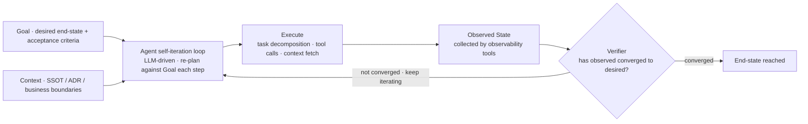
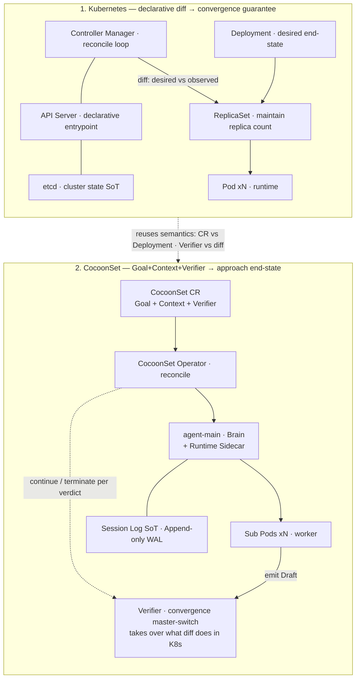
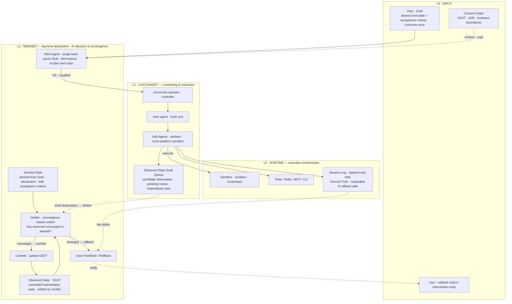
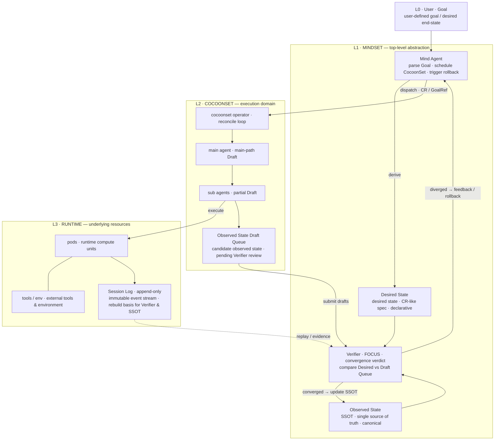
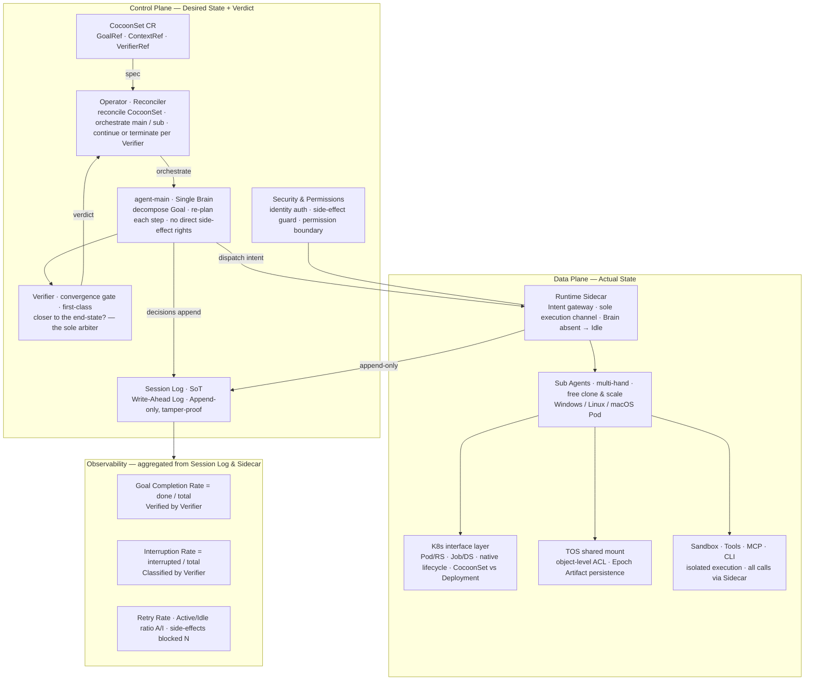

# Next-Gen Agent Infra Design — CocoonSet & MindSet

| | Today (shipped) | Tomorrow (planned) |
|---|---|---|
| Scheduling layer | **CocoonSet** — the `cocoonset.cocoonstack.io/v1` CRD, reconciled by `cocoon-operator`, running on `vk-cocoon` nodes | **MindSet** — the top-level cognitive layer; **not in the codebase**, it is the direction this doc defines |
| Agent shape | `spec.agent.kind: desktop` (cloud desktop) / `autonomous` (self-driving agent, see ADR-0003) | A Mind Agent orchestrates multiple CocoonSets, converging on a Goal |
| Convergence verdict | Operator reconciles replica count / node selection | Verifier judging "closer to the end-state?" |

---

## 1. Agent Shape: an Agent Is an Intelligent Workload

An Agent should no longer be treated as a simple "chat box" — it should evolve into an **intelligent Workload**. Its core characteristics:

- **Form and responsibility.** An **LLM-driven self-iteration loop** is the core. Memory is realized through state management: the Agent repeatedly compares `desired state` against `observed state` until it converges on the end-state.
- **Collaboration interface.** Driven by a **Goal (the desired end-state)**, not by a stream of fine-grained instructions.
- **Runtime elements.** It runs inside the secure sandbox and tool set (Tools / Skills) provided by a **Runtime**, deeply reusing the cloud-native ecosystem. Within the given Goal constraints the Agent decides autonomously — task decomposition, tool invocation, context fetching — until the end-state is reached.

> **Figure 1 · The Agent self-iteration loop.** Goal and Context are one-shot inputs. The Agent does not run a pre-frozen plan — it re-generates the plan against the Goal at every step, and the Verifier decides whether the loop stops.

---

## 2. Core Observations

### 2.1 A single Goal-driven loop keeps expanding its reach

As model capability grows, an Agent loop built around one goal can cover an ever-larger problem space and run for ever-longer durations. By contrast, a traditional Harness assembled from multi-stage pipelines is more prone to **goal drift** once the run path gets long, eventually deviating from the user's original intent.

> A human's pre-frozen, immutable plan **will** drift; only a plan the Agent re-generates against the Goal at every step can converge.

### 2.2 Context retrieval is shifting from centralized services to local search

Context windows keep growing, and current SOTA coding agents commonly fetch context via local `grep` and file scans. This means a Context Service built on a centralized scheme such as RAG is losing importance in some development scenarios.

### 2.3 Specs and Goals should be consume-once

Every Spec or Goal should be discarded once the task completes — it should not settle into long-lived system state. Humans and Agents rarely re-read these one-shot goal descriptions. **Anything that can be inferred from code, configuration, or the running environment should not be separately preserved as context.**

### 2.4 The Verifier is the master switch for whether the whole system converges

Kubernetes reconciliation converges because both `desired state` and `observed state` are declarative and structured — the diff is near-zero-cost and unambiguous. But "is the goal achieved?" is an **AI-hard, expensive, ambiguous** judgment.

> A long-running Agent with a weak Verifier does not stop at a wrong state — it **confidently converges in the wrong direction**, because the loop itself rewards "looks done."

Observability and the Verifier are not the same thing: **the former tells you what happened; the latter judges whether you are closer to the end-state.**

---

## 3. Engineering Implementation

### 3.1 Architecture call: control plane / data plane / memory

The **control plane** has three parts: a Goal file, a Context folder, and a Verifier.

- The **Goal file** defines the task's desired end-state, and must contain executable acceptance criteria (tests, assertions, oracles) — not just a natural-language description of the end-state.
- The **Context folder** holds only SSOT information that cannot be inferred from code or the running environment: config keys, deployment architecture, human constraints, business boundaries, organizational rules, and irreversible decision records (ADRs). Session-related information and derived queries are not context — they are a class of skills / tools.
- The **Verifier** is peer-level with the Goal; it judges whether `observed state` is converging toward `desired state`. It must not be demoted into an accessory of Observability.

The **data plane** comprises Sandbox, Tools, Skills, MCP, CLI, security mechanisms, observability, and the Session Log. Together they let the Agent actually execute tasks, call tools, isolate risk, record the process, and track state. The observability component supplies the `observed state`.

**On memory** — memory is fundamentally end-state management and traceability; it requires discarding the authority of intermediate state. The Session Log grows unbounded for a long-running Agent, so the Agent must rely on some compressed view to work:

| Role | Position | Authority |
|---|---|---|
| **Session Log** | Write-Ahead Log. Append-only, never mutated | The only ground truth |
| **SSOT** | Committed State. The committed authoritative state | Authoritative |
| **Intermediate state** (summary, heuristics, index) | Materialized View / Cache. Usable because it is fast | **Never authoritative**; rebuildable from `SSOT + Log + Code`; invalidate and recompute whenever in doubt |

> A long-running Agent keeps summarizing its own dialogue, outputs, and behavior, settling them into heuristics — the root of distortion and error accumulation is treating the cache as truth. The fix is not to ban the cache, but to **forbid the cache from being promoted to truth**: the Agent still runs on the compressed view, but must always be able to fall back to the raw Log, and a summary is forever *derived*, never *authoritative*.

### 3.2 Evolution path: the intelligent Workload

An Agent should no longer be understood as a continuous human-facing chat system — it should evolve into a **Workload**. In this form:

- **Goal** is a one-shot human input that defines the task's desired end-state, not a continuously-interactive chat context. A good Goal is clear, result-verifiable, and preserves a large search space and high parallelism. Humans should not freeze the task into a linear pipeline — they should give the Agent enough autonomous planning room.
- **Agent** is carried by a set of Runtimes; it runs long-lived and self-iterates inside the Runtime's execution environment, tool set, and security boundary, until `desired state` (defined by the Goal) and `observed state` (obtained by observability tools) converge.
- **Runtime** is both the scheduling carrier and the execution tool for the Agent, carrying three duties:
  - **Schedule Agents** — start, manage, resume, and terminate Agent instances based on Goal and Context;
  - **Supply Agents** — respond to Agent requests by dynamically providing new Runtimes, Sandboxes, Tools, Skills, MCP, CLIs, or sub-Agents, forming an extensible, composable, recursive Agent Workload system;
  - **Observe & roll back** — provide the Agent with a security boundary, observability, and the Session Log.

This pattern maps onto the relationship between Deployment, Controller, Pod, and the underlying Runtime in Kubernetes:

| Kubernetes | Agent Infra | Responsibility |
|---|---|---|
| Deployment / Workload | Goal | Defines the desired end-state |
| Controller | Operator + Verifier | Continuous scheduling and state convergence |
| Pod | Agent execution unit | Executes concrete tasks |
| Container Runtime | Agent Runtime | Provides the underlying execution environment; callable by upper layers and by the execution units themselves to create new units |

> **Figure 3 · Control-plane / data-plane scheduling: Kubernetes vs CocoonSet.** CocoonSet reuses the K8s "declarative workload + reconciliation" semantics, extending "workload" into "Agent workload." The one new first-class citizen is the **Verifier** — because in the Agent setting "is it done?" is AI-hard and cannot be settled by a zero-cost structured diff.

### 3.3 Landing it: MindSet × CocoonSet × Runtime, three layers

#### The three elements of MindSet

| Element | Content |
|---|---|
| **Desired State (Goal)** | The task's desired end-state file. Not just a natural-language description — it must carry executable acceptance criteria. |
| **Observed State (SSOT)** | The committed physical-fact state. Records committed environment information as the bedrock for later decisions. |
| **Mind Agent container** | (1) Interaction & modeling — help the user shape the Goal, and abstract an observable State out of the SSOT; (2) Verifier role — act as the convergence master-switch, judging whether a Draft state is converging toward the Goal. |

> **The key shift:** a MindSet Operator brings up the Mind Agent Pod. After reaching consensus with the user, the Mind Agent dynamically configures a group of `CocoonSet`s (each mapping to one major-direction Task) and moves into the execution phase.

> **Figure 4 · Agent Infra: MindSet × CocoonSet × Runtime.** Each layer has its job — **L1 MindSet** does AI decision-making and the convergence verdict, **L2 CocoonSet** does scheduling and execution, **L3 Runtime** provides the sandbox, tools, and Session Log. Control flows top-down as dispatch; drafts flow bottom-up to the Verifier; a commit writes back to the SSOT.

#### CocoonSet: the underlying scheduling Operator

Under MindSet's direction, the **CocoonSet Operator** is the scheduler of the underlying Runtime, managing the concrete execution units.

**Single Brain + Multi Workers:**

- **Main Agent (Brain)** — handles task decomposition and logic execution. It periodically aggregates progress and pushes SSOT state diffs into the `Observed State Draft` queue.
- **Tool containers (Hands)** — via CocoonSet's Tool capability, the Main Agent can call containers of different images. For example, the main logic runs in a Linux Codex image, while a specific compilation task is dispatched to a Windows Tool container.

**State-verdict flow:**

| Step | Participant | Action | Output |
|---|---|---|---|
| 1 · Execute | Main / Sub Agent | Run the task in the Sandbox and record the Session Log | `Observed Draft` |
| 2 · Review | Verifier (MindSet) | Compare the Draft against the Desired State for divergence | Convergence verdict |
| 3 · Commit | MindSet | If converged, update the SSOT file | `Committed State` |
| 4 · Exception | MindSet | If not converged, trigger rollback or request user intervention | `Rollback Command` |

> **Figure 5 · MindSet top-level abstraction — the convergence & rollback architecture.** Top-down: User Goal → MindSet decision → CocoonSet execution → Runtime feedback → Verifier convergence verdict. **Converged** writes back to the SSOT; **not converged** feeds back / rolls back. The SSOT is only ever written by the Verifier, after convergence.

### 3.4 Reversibility: determinism grounded in the Session Log

To handle the drift a long-running Agent may exhibit, the system mandates that every execution unit be **rollback-capable**.

**The WAL nature of the Session Log** — the Session Log is treated as a Write-Ahead Log:

- **Append-only** — records all raw decisions and side effects.
- **Authoritative** — any intermediate Summary is forever *derived*; whenever in doubt, invalidate the cache and rebuild from the Log.

**The rollback execution path** — when a rollback command arrives (passed via a specific field on the `CocoonSet` CR), each sub-Agent follows this logic:

1. **Prompt constraint** — at startup the Agent is told: "you are rollback-able based on the Log; lossy is acceptable, but it must be reversible."
2. **Inverse operations** — using the Session Log records, inversely undo the physical side effects already produced (e.g. delete temporary resources, revert configuration).

### 3.5 Observability metrics

The design philosophy lands on two levels, and convergence quality is measured by a set of observability metrics.

**Cognitive level (MindSet):**

- Emphasize "consume-once": the Goal is discarded once the task completes; it never settles into system state.
- **The Verifier is the core**: do not demote the Verifier to an observability tool — it is the master switch that decides whether the system halts.

**Physical level (Runtime):**

- **No cache usurpation**: a cache is only for speed; it must never be promoted to Truth.
- **Heterogeneous execution power**: physical isolation for cross-platform task execution, solved through multi-image Tool containers.

> **Figure 6 · Agent Workload — Infra capability map & observability metrics.** The control plane declares the end-state and the Verifier judges convergence; the data plane produces side effects only through the Runtime Sidecar — the sole execution channel; all metrics aggregate from the Session Log and Sidecar metrics, and **the definition of the core metrics is owned by the Verifier** — "Goal Completion Rate" and "Interruption Rate" are judged / classified by the Verifier, not guessed from log keywords.

---

## 4. Today vs Planned

This design lands in two steps. **CocoonSet is the substrate already running**; **MindSet is the cognitive layer above it.**

### 4.1 CocoonSet

- **CRD**: `cocoonset.cocoonstack.io/v1`, Kind `CocoonSet` (short name `cs`), reconciled by `cocoon-operator`, admission-validated by `cocoon-webhook`.
- **The Agent-shape discriminator field**: `spec.agent.kind` (see ADR-0003 in the `cocoon-family` repo) —
  - `kind: desktop` (default): the cloud-desktop workload consumed by `cocoon-clouddesktop` (human RDP / SSH desktops, replica clone-out);
  - `kind: autonomous`: the self-driving Agent workload — an LLM self-iteration loop + sub-Pod workers, requiring a `goalRef` or an inline `goal`.
- **Runtime model**: `vk-cocoon` is the virtual-kubelet provider; it registers each EBM bare-metal host as one K8s node. Pods derived by the Operator are scheduled onto those nodes, and the `cocoon` CLI brings up the MicroVMs.
- **"Single Brain + Multi Workers" already has an embryo**: ADR-0003 already defines the brain / runtime split and `goalRef` content-addressing for the `autonomous` shape — which is precisely the L2 execution domain of MindSet.

### 4.2 MindSet (planned)

What MindSet adds above CocoonSet is the **cognitive layer**:

| Capability | Today (CocoonSet) | What MindSet adds |
|---|---|---|
| Convergence verdict | Operator reconciles replica count / node selection via structured diff | Verifier judging the AI-hard question "closer to the end-state?" |
| Goal modeling | `goalRef` / inline `goal` (one Goal per CocoonSet) | A **Mind Agent** reaches Goal consensus with the user and splits it into a group of CocoonSets |
| Multi-task orchestration | One CRD, one workload | A MindSet Operator brings up the Mind Agent, which dynamically configures multiple CocoonSets |
| Rollback | Pod-level teardown | **Deterministic rollback based on the Session Log** — inversely undo physical side effects |
| Memory | Session Log (per Pod) | A three-tier memory model — SSOT / WAL / Materialized View — forbidding cache usurpation |

Suggested landing order: first **promote the Verifier to a first-class citizen** (an M4+ direction beyond the current `roadmap.md` M0–M3), then **multi-CocoonSet orchestration**, and finally **Mind Agent interaction modeling**.

---

## 5. Design Philosophy: the one-line principle list

1. **An Agent is a Workload, not a chat box** — driven by a Goal, self-iterating in a Runtime until convergence.
2. **A human's plan will always drift** — only a plan re-generated against the Goal at every step can converge.
3. **Goals / Specs are consume-once** — anything inferable from code and environment is not separately stored as context.
4. **The Verifier is the convergence master switch** — it judges "closer to the end-state?"; Observability only answers "what happened?"
5. **The cache must not usurp** — a summary is forever derived; the Session Log (WAL) is the ground truth.
6. **Reversibility is a hard constraint** — lossy is acceptable, but it must be rollback-able based on the Log.
7. **Reuse cloud-native semantics** — `CR ≈ Deployment`, `Verifier ≈ diff`; reuse the K8s reconciliation mental model.
