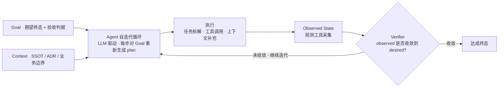
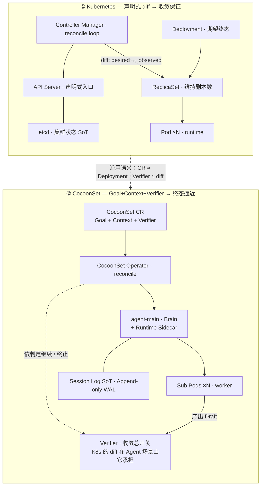
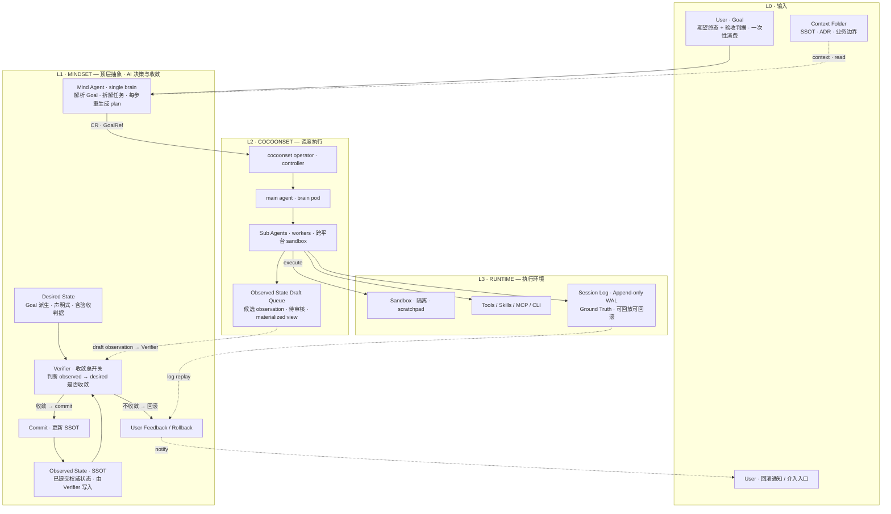
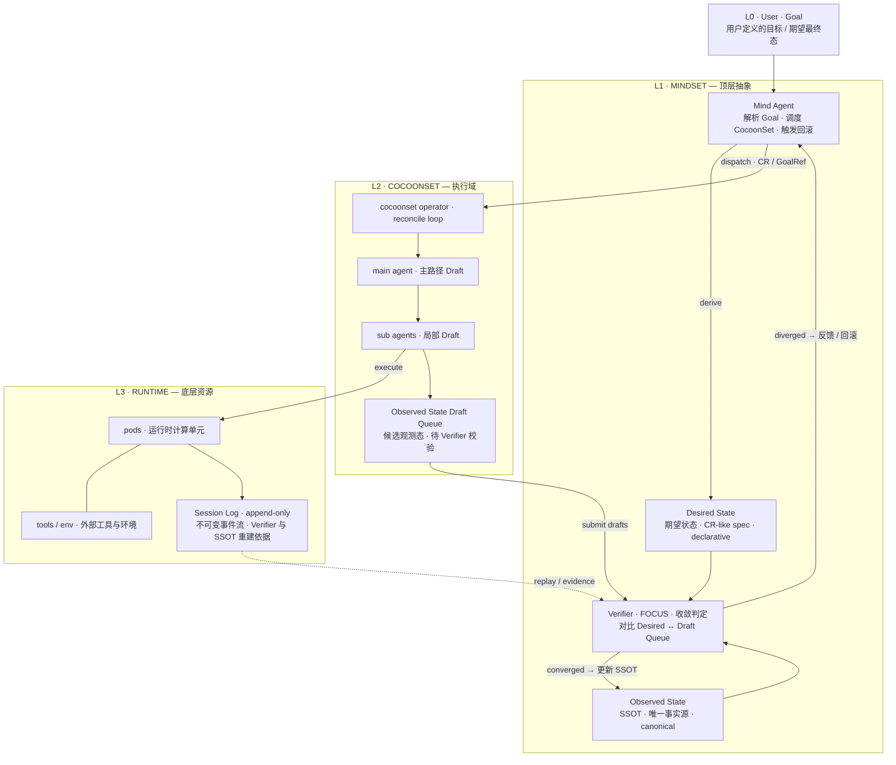
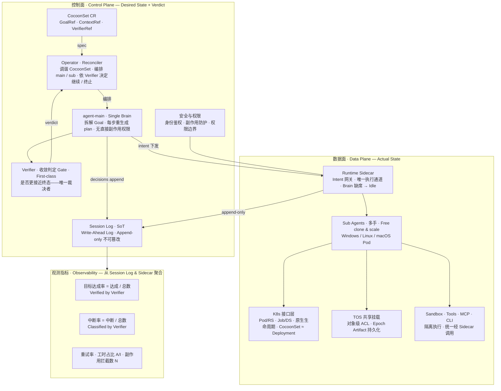

# 下一代 Agent Infra 设计思路 — CocoonSet 与 MindSet

| | 今天（已落地） | 明天（规划中） |
|---|---|---|
| 调度层 | **CocoonSet** — `cocoonset.cocoonstack.io/v1` CRD，已由 `cocoon-operator` 调谐、在 `vk-cocoon` 节点上运行 | **MindSet** — 顶层认知层，目前**不在代码里**，是本文定义的方向 |
| Agent 形态 | `spec.agent.kind: desktop`（云桌面）/ `autonomous`（自驱 Agent） | Mind Agent 编排多个 CocoonSet，按 Goal 收敛 |
| 收敛判定 | Operator 调谐副本数 / 节点选择 | Verifier 判定「是否更接近终态」 |

---

## 一、Agent 形态：Agent 是一种智能 Workload

Agent 不应再被视为简单的「对话框」，而应演进为一种**智能 Workload**。其核心特征包括：

- **形态与职责**：以 **LLM 驱动的自迭代循环**为核心，通过 state（状态）管理实现记忆，不断对比 `desired state` 与 `observed state`，直至收敛至终态。
- **协作接口**：通过 **Goal（期望终态）**进行驱动，而非依赖琐碎的指令流。
- **运行时要素**：在 **Runtime** 提供的安全沙箱与工具集（Tools / Skills）中运行，深度复用云原生生态。Agent 在既定的目标约束下自主决策——包括任务拆解、工具调用及上下文补充——直到达成终态。

> **图 1 · Agent 自迭代循环。** Goal 与 Context 一次性输入；Agent 不执行预先固化的 plan，而是每一步对着 Goal 重新生成 plan，由 Verifier 决定循环是否停下。

---

## 二、核心观察

### 2.1 单一 Goal 驱动的循环能力正在持续扩大

随着模型能力增强，一个围绕单一目标展开的 Agent 循环，能够覆盖的问题范围越来越大，执行时间也越来越长。相比之下，传统由多阶段 Pipeline 组成的 Harness，在运行链路变长后更容易出现**目标漂移**，最终偏离用户最初意图。

> 人类预先固化、不可变的 plan 一定会漂移；Agent 每一步对着 Goal 重新生成的 plan 才能收敛。

### 2.2 上下文获取方式正在从中心化服务转向本地化检索

Context Window 持续扩大，同时当前 SOTA 的 Coding Agent 普遍采用本地 `grep`、文件扫描等方式获取上下文。这意味着，基于 RAG 等中心化方案构建的 Context Service，在部分开发场景中的重要性正在下降。

### 2.3 Spec 与 Goal 应具备一次性消费特征

每个 Spec 或 Goal 在任务完成后都应被及时丢弃，而不应长期沉淀为系统状态。人类和 Agent 通常都不会再次阅读这些一次性目标描述。**凡是能够从代码、配置或运行环境中推断出的信息，都不应额外保留为独立上下文。**

### 2.4 Verifier 是整个体系能否收敛的总开关

Kubernetes 的 reconciliation 能收敛，是因为 `desired state` 与 `observed state` 都是声明式、结构化的，diff 几乎零成本、无歧义。但「目标是否达成」是一个 **AI-hard、昂贵、有歧义**的判断。

> Verifier 弱的长跑 Agent 不会停在错误状态——它会**自信地朝错误方向收敛**，因为 loop 本身在奖励「看起来完成了」。

Observability 与 Verifier 不是一回事：**前者告诉你发生了什么，后者判断是否更接近终态。**

---

## 三、工程落地

### 3.1 架构判断：控制面 / 数据面 / 记忆

**控制面**由三个部分组成：一个 Goal 文件、一个 Context 文件夹、一个 Verifier。

- **Goal 文件**定义任务的期望终态，且必须包含可执行的验收判据（测试、断言、oracle），而不只是自然语言描述的终态。
- **Context 文件夹**只保存无法从代码或运行环境推断出的 SSOT 信息：配置 Key、部署架构、人类约束、业务边界、组织规则，以及不可逆决策记录（ADR）。用户会话相关的信息及衍生查询不应视为 context，而是一类 skills / tools。
- **Verifier** 与 Goal 同级，负责判断 `observed state` 是否在向 `desired state` 收敛。它不能被降格为 Observability 的附属能力。

**数据面**包括 Sandbox、Tools、Skills、MCP、CLI、安全机制、可观测能力以及 Session Log。这些组件共同承担 Agent 实际执行任务、调用工具、隔离风险、记录过程和追踪状态的职责。其中观测组件负责提供 `observed state`。

**关于记忆**——记忆的本质是最终状态管理和回溯，需要丢弃中间状态的权威性。Session Log 对长跑 Agent 会无限膨胀，Agent 必须依赖某种压缩视图才能工作：

| 角色 | 定位 | 权威性 |
|---|---|---|
| **Session Log** | Write-Ahead Log。Append-only，只增不改 | 唯一的 ground truth |
| **SSOT** | Committed State。已提交的权威状态 | 权威 |
| **中间状态**（summary、经验规则、index） | Materialized View / Cache。可以用，因为快 | **永远不权威**，可从 `SSOT + Log + Code` 重建，存疑即 invalidate 重算 |

> 长时间运行的 Agent 不断 summarize 自己的对话、产出、行为，把它们沉淀成经验规则——失真与错误累积的根源，正是把 cache 当成了 truth。修复方式不是禁止 cache，而是**禁止 cache 升格为 truth**：Agent 照常在压缩视图上跑，但要始终能 fallback 到原始 Log，且 summary 永远是 derived，而非 authoritative。

### 3.2 演进路径：智能 Workload

Agent 不应继续被简单理解为面向人类的连续对话系统，而应逐步演进为一种 **Workload**。在这种形态下：

- **Goal** 是人类的一次性输入，用于定义任务的期望终态，而不是持续交互的聊天上下文。一个好的 Goal 应当目标清晰、结果可验证，并尽量保留较大的搜索空间和较高的并行度。人类不应把任务固化为线性 Pipeline，而应给 Agent 足够的自主规划空间。
- **Agent** 由一组 Runtime 承载，在 Runtime 提供的执行环境、工具集合和安全边界内长期运行、持续自迭代，直到收敛 `desired state`（Goal 定义）与 `observed state`（观测工具得到）。
- **Runtime** 既是 Agent 的调度载体，也是 Agent 的执行工具，同时承担三类职责：
  - **调度 Agent**：根据 Goal 和 Context 启动、管理、恢复和终止 Agent 执行实例；
  - **供给 Agent**：响应 Agent 的请求，动态提供新的 Runtime、Sandbox、Tools、Skills、MCP、CLI 或子 Agent，从而形成可扩展、可组合、可递归的 Agent Workload 体系；
  - **观测回滚**：为 Agent 提供安全边界、观测能力和 Session Log。

这个模式可以类比 Kubernetes 中 Deployment、Controller、Pod 与底层 Runtime 的关系：

| Kubernetes | Agent Infra | 职责 |
|---|---|---|
| Deployment / Workload | Goal | 定义期望终态 |
| Controller | Operator + Verifier | 持续调度与状态收敛 |
| Pod | Agent 执行单元 | 执行具体任务 |
| 容器 Runtime | Agent Runtime | 提供底层执行环境，可被上层与执行单元自身调用以创建新执行单元 |

> **图 3 · 控制面 / 数据面调度对比：Kubernetes vs CocoonSet。** CocoonSet 沿用 K8s「声明式工作负载 + 调谐」语义，把「工作负载」扩展为「Agent 工作负载」；唯一新增的一等公民是 **Verifier**——因为 Agent 场景下「是否完成」是 AI-hard，无法靠零成本结构化 diff 判定。

### 3.3 MindSet × CocoonSet × Runtime 三层落地

#### MindSet 三要素

| 要素 | 内容 |
|---|---|
| **Desired State（Goal）** | 任务的期望终态文件。不仅包含自然语言描述，还必须包含可执行的验收判据。 |
| **Observed State（SSOT）** | 已提交的物理事实状态。记录 Committed 的环境信息，作为后续决策的基石。 |
| **Mind Agent 容器** | ① 交互与建模——协助用户制定 Goal，并从 SSOT 抽象出可观测的 State；② Verifier 职能——作为收敛总开关，判定 Draft 状态是否向 Goal 收敛。 |

> **关键变革：** MindSet Operator 负责拉起 Mind Agent Pod。Mind Agent 在与用户达成共识后，会动态配置一组 `CocoonSet`（每个对应一个大方向 Task）进入执行阶段。

> **图 4 · Agent Infra：MindSet × CocoonSet × Runtime。** 三层各司其职——**L1 MindSet** 做 AI 决策与收敛判定，**L2 CocoonSet** 做调度执行，**L3 Runtime** 提供沙箱、工具与 Session Log。控制流自上而下 dispatch，draft 自下而上交给 Verifier，commit 写回 SSOT。

#### CocoonSet：底层的调度 Operator

在 MindSet 的指挥下，**CocoonSet Operator** 是底层 Runtime 的调度器，负责管理具体的执行单元。

**单脑多手模式（Single Brain + Multi Workers）：**

- **Main Agent（Brain）**：负责具体的任务拆解与逻辑执行。它定期汇总进度，将 SSOT 的状态差异推入 `Observed State Draft` 队列。
- **Tool 容器（Hands）**：利用 CocoonSet 的 Tool 功能，Main Agent 可以调用不同 Image 的容器。例如，主逻辑跑在 Linux Codex 镜像中，而特定的编译任务则派发给 Windows Tool 容器处理。

**状态判定流：**

| 步骤 | 参与方 | 动作 | 输出结果 |
|---|---|---|---|
| 1 · 执行 | Main / Sub Agent | 在 Sandbox 执行任务并记录 Session Log | `Observed Draft` |
| 2 · 审核 | Verifier（MindSet） | 对比 Draft 与 Desired State 的偏离度 | 收敛判定 |
| 3 · 提交 | MindSet | 若收敛，则更新 SSOT 文件 | `Committed State` |
| 4 · 异常 | MindSet | 若不收敛，则触发回滚或请求用户介入 | `Rollback Command` |

> **图 5 · MindSet 顶层抽象——收敛与回滚架构。** 自上而下：User Goal → MindSet 决策 → CocoonSet 执行 → Runtime 反馈 → Verifier 收敛判定。**收敛**则写回 SSOT，**不收敛**则反馈 / 回滚。SSOT 永远只由 Verifier 在收敛后写入。

### 3.4 可回滚性：基于 Session Log 的确定性

为了应对长跑 Agent 可能出现的漂移，系统强制要求所有执行单元具备「可回滚」能力。

**Session Log 的 WAL 属性** —— Session Log 被视为 Write-Ahead Log：

- **Append-only**：记录所有原始决策与副作用。
- **Authoritative**：中间生成的 Summary 永远是派生的（Derived），任何时候存疑都应 invalidate 缓存并从 Log 重建。

**回滚执行路径** —— 当收到回滚命令（通过 `CocoonSet` CR 的特定字段传递）时，各子 Agent 遵循以下逻辑：

1. **Prompt 约束**：Agent 在启动时被告知「依据 Log 可回滚；接受有损，但必须可回滚」。
2. **逆向操作**：依据 Session Log 的记录，逆向撤销已产生的物理副作用（如删除临时资源、回退配置）。

### 3.5 观测指标

设计理念分两个层面落地，并通过一组观测指标度量收敛质量。

**认知层面（MindSet）：**

- 强调「一次性消费」：Goal 在任务完成后即丢弃，不沉淀为系统状态。
- **Verifier 是核心**：不把 Verifier 降格为观测工具，它是决定系统是否停机的「总开关」。

**物理层面（Runtime）：**

- **禁止 Cache 篡权**：Cache 只能用于提速，不能升格为 Truth。
- **异构执行力**：通过多镜像 Tool 容器解决跨平台任务执行的物理隔离。

> **图 6 · Agent Workload — Infra 能力映射与观测指标。** 控制面声明终态并由 Verifier 判定收敛；数据面经 Runtime Sidecar 这一唯一执行通道产生副作用；观测指标全部从 Session Log 与 Sidecar metrics 聚合，**核心指标口径由 Verifier 定义**——「目标达成率」和「中断率」由 Verifier 判定 / 归类，而非由日志关键字猜测。

---

## 四、现状 vs 规划

本文的设计分两步落地。**CocoonSet 是已经在跑的底座**；**MindSet 是它之上的认知层**。

### 4.1 CocoonSet

- **CRD**：`cocoonset.cocoonstack.io/v1`，Kind `CocoonSet`（短名 `cs`），由 `cocoon-operator` 调谐，`cocoon-webhook` 准入校验。
- **Agent 形态判别字段**：`spec.agent.kind` —
  - `kind: desktop`（默认）：云桌面工作负载——人类 RDP / SSH 桌面、副本克隆；
  - `kind: autonomous`：自驱 Agent 工作负载——LLM 自迭代循环 + 子 Pod worker，要求 `goalRef` 或内联 `goal`。
- **运行模型**：`vk-cocoon` 作为 virtual-kubelet provider，把每台 EBM 裸金属注册成一个 K8s node；Operator 派生的 Pod 调度到这些节点，由 `cocoon` CLI 拉起 MicroVM。

### 4.2 MindSet（规划）

MindSet 要在 CocoonSet 之上补齐的，是**认知层**：

| 能力 | 现状（CocoonSet） | MindSet 要补的 |
|---|---|---|
| 收敛判定 | Operator 调谐副本数 / 节点选择，结构化 diff | Verifier 判定「是否更接近终态」这一 AI-hard 问题 |
| Goal 建模 | `goalRef` / 内联 `goal`（单个 CocoonSet 一个 Goal） | **Mind Agent** 与用户共识 Goal，并拆成一组 CocoonSet |
| 多任务编排 | 单 CRD 单工作负载 | MindSet Operator 拉起 Mind Agent，动态配置多个 CocoonSet |
| 回滚 | Pod 级 teardown | **基于 Session Log 的确定性回滚**——逆向撤销物理副作用 |
| 记忆 | Session Log（按 Pod） | SSOT / WAL / Materialized View 三级记忆模型，禁止 cache 篡权 |

落地次序：先把 **Verifier 抽成一等公民**，再做 **多 CocoonSet 编排**，最后做 **Mind Agent 交互建模**。

---

## 五、设计理念总结：一句话原则清单

1. **Agent 是 Workload，不是对话框**——由 Goal 驱动，在 Runtime 中自迭代至收敛。
2. **人类的 plan 一定漂移**——只有每步对着 Goal 重生成的 plan 才能收敛。
3. **Goal / Spec 一次性消费**——能从代码与环境推断的，不另存为上下文。
4. **Verifier 是收敛总开关**——它判断「是否更接近终态」，Observability 只回答「发生了什么」。
5. **Cache 不得篡权**——summary 永远是 derived，Session Log（WAL）才是 ground truth。
6. **可回滚是硬约束**——接受有损，但必须可依据 Log 回滚。
7. **沿用云原生语义**——`CR ≈ Deployment`、`Verifier ≈ diff`，复用 K8s 调谐心智模型。
